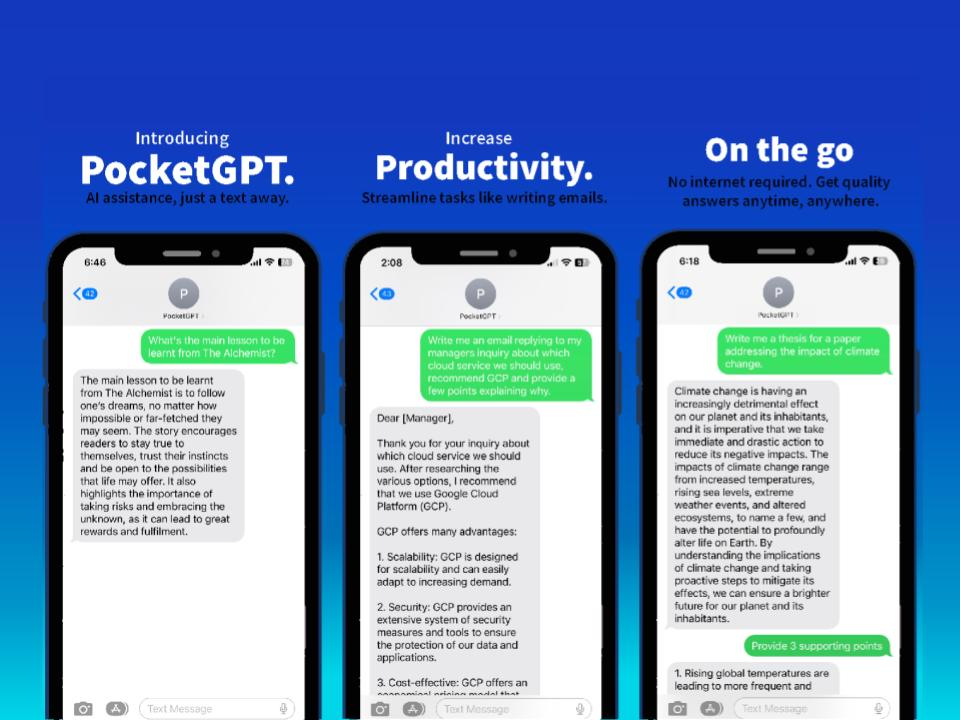

# PocketGPT 

PocketGPT is a sms-chatbot driven by GPT-3.5. It allows for instant answers via text, without any need for internet connectivity.

**Acquired 30+ users** in the first day, who collectively logged **over 3000 interactions** with the service.

  

## How does it work?
**1. Web App Structure:**
* The main application logic is contained within the chatgpt function in app.py.
* The Flask web app handles incoming SMS messages at the "/sms" endpoint using Twilio's messaging response library.

**2. User Verification:**
* The application verifies incoming numbers against a database fetched from Google Sheets.
* If a number is not registered, a message with a registration link is sent to prompt sign-up.

**3. Chat Interaction:**
* Users send messages, and the application processes them by updating a chat log stored in the session.
* The chat log is used to generate a response using OpenAI's GPT-3.5-turbo model through the ask function in functions.py.

**4. Message Handling:**
* Messages are represented as objects with roles (user, assistant) and content.
* The chat log is managed and trimmed to ensure it doesn't exceed a certain length.

**5. External Services:**
* The application uses Google Sheets to store and retrieve a list of registered users.
* The Google Sheets API is utilized in the update_list function within functions.py to access and update the user database.

### Tech Stack
Python, OpenAI, Twilio, Google Sheets API, Flask
